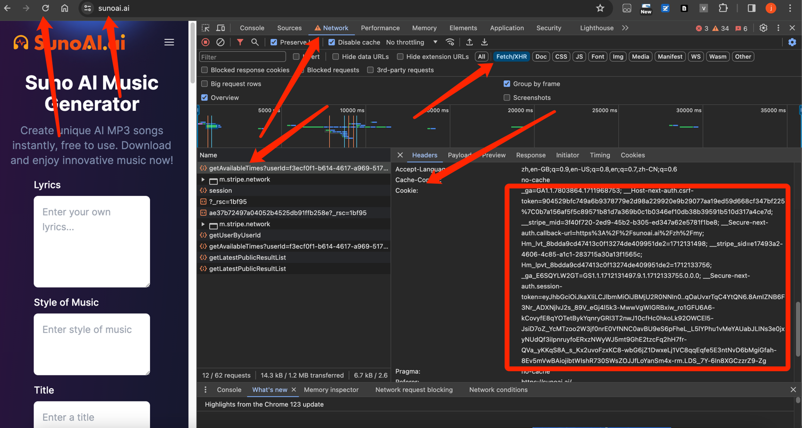

[English](README.md) | [中文](./README-CN.md) | 日本語

<p align="center"><a href="https://sunoai.ai/" target="_blank" rel="noopener noreferrer"></a></p>

<p align="center">
  <a href="https://github.com/YunzhiYike/Suno-SDK/releases"></a>
  <a href="https://www.php.net"></a>
  <a href="https://github.com/YunzhiYike/Suno-SDK/main/LICENSE"></a>
</p>
<p align="center">
  <a href="https://packagist.org/packages/yunzhiyike/suno-ai-sdk"></a>
  <a href="https://packagist.org/packages/yunzhiyike/suno-ai-sdk"></a>
</p>

# 非公認 Suno PHP-SDK
これはPHPベースの非公式なSuno APIで、Sunoのすべてのインターフェースをサポートしています。

## インストール

```bash
composer require yunzhiyike/suno-ai-sdk
```

## メソッド

- [x] `generateMusic` [記述: ジェネレート・ミュージック, 戻る, `uid` ]
- [x] `refreshSession` [記述: セッション生存時間の延長, 戻る `PersonalInfoEntity` ]
- [x] `getUserInfoByEmail` [記述: 電子メールによるユーザー情報の取得, 戻る `PersonalInfoEntity` ]
- [x] `getWorkList` [記述: 生成された楽曲リストの取得, 戻る `WorkEntity[]` ]
- [x] `getAvailableTimes` [記述: 利用可能回数取得, 戻る  `int` ]


## Cookie 引き出す 🚗

> 在此之前你需要先登录！




## 典型例 🌲
```php
<?php

declare(strict_types=1);
/**
 * This file is part of Yunzhiyike
 */

namespace Yunzhiyike\Test;

use PHPUnit\Framework\TestCase;
use Yunzhiyike\SunoAiSdk\SunoAi;

/**
 * @internal
 * @coversNothing
 */
class SunoAiTest extends TestCase
{
    public function test()
    {
        $cookie = 'your suno-ai cookie';
        $timeOut = 60;
        $sunoApi = new SunoAi($cookie, $timeOut);
        $info = $sunoApi->refreshSession();
        $userInfo = $sunoApi->getUserInfoByEmail($info->getEmail());
        $page = 1;
        $res = $sunoApi->getWorkList($userInfo->getUserId(), $page);
        foreach ($res as $r) {
            var_dump($r);
        }
        var_dump($sunoApi->getAvailableTimes($userInfo->getUserId()));
        var_dump($sunoApi->generateMusic($userInfo->getUserId(), 'music title', 'music text', 'music tags', true));
    }
}

```
